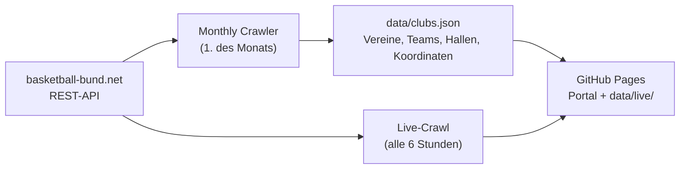

# Basketball Vereinsregister

Findet Basketballvereine und Teams in Deutschland — per Namens- oder Umkreissuche, mit aktuellen Tabellen und Spielplänen.

**Portal:** <https://olieder.github.io/basketball-vereinsregister-deutschland/>

[](https://buymeacoffee.com/olivermarcus.eder)
[](https://ko-fi.com/OliEder)

Datenquelle: REST-API von [basketball-bund.net](https://www.basketball-bund.net). Beobachtungen zur API stehen in [docs/bbb-api.md](docs/bbb-api.md), die [OpenAPI-Spezifikation](https://github.com/OliEder/basketball-bund-api/blob/main/basketball-bund-net-api-V1.yaml) liegt in einem eigenen Repository. Koordinaten stammen von [Nominatim](https://nominatim.openstreetmap.org) (OpenStreetMap).

## Was das Portal kann

- **Suche** nach Vereinsname (Fuzzy) und im Umkreis eines Ortes, mit Kartenansicht
- **Vereinsseite** (`verein.html?id=<clubId>`): Teams mit Liga und Tabellenplatz, Hallen mit Karte, Links
- **Team-Seite** (`team.html?id=<teamPermanentId>`): Tabellenplatz, Bilanz, Form, nächstes Spiel, Tabelle und Spielplan (Alle/Heim/Auswärts); bei mehreren Wettbewerben (Liga, Pokal) ein Umschalter
- Das Portal ist **rein statisch** (GitHub Pages). Die Suche läuft im Browser, es gibt keinen Server und keinen CORS-Proxy.

## So hängt alles zusammen



| Daten | Quelle | Aktualisierung | Ablage |
|---|---|---|---|
| Vereine, Teams, Hallen, Koordinaten | Monthly Crawler | monatlich | `data/clubs.json` (im Repo, wird committet) |
| Tabellen, Spielpläne | Live-Crawl pro Liga | alle 6 Stunden | `data/live/` (nur im Pages-Artefakt, nicht im Repo) |
| Tabellen, Ergebnisse je Saison | Saison-Archiv aus den Live-Daten | täglich | Branch `season-archive` (`<saison>/liga/<id>.json.gz`) |

Der Live-Crawl holt pro Liga **eine** Anfrage (`competition/spielplan/id/{ligaId}`), die Spiele und Tabelle liefert, und schreibt `liga/<id>.json`, `team-index.json` (Team → Ligen) und `index.json`. Zwischen zwei Läufen bleiben die zuletzt gecachten Live-Daten erhalten, auch bei Portaländerungen. Beim Zusammenstellen des Artefakts entsteht außerdem `hall-index.json` (Club-ID → Heimhalle, `crawler/hall-index.ts`); die Team-Seite zeigt damit Spielort und Karte des nächsten Spiels. Der Ort gilt als voraussichtlich: bei Heimspielen die Heimhalle des eigenen Vereins, sonst die des gastgebenden Gegners.

## Kalender-Abo

Jede Team-Seite bietet das Abo für **alle Spiele**, **nur Heimspiele** oder **nur Auswärtsspiele**, mit den Wegen **iPhone / Mac** (`webcal://`), **Android (Google Kalender)**, **Link kopieren** und **Als Datei (.ics)** sowie einer kurzen Erklärung. Die Dateien liegen unter `ics/<teamPermanentId>.ics`, `-heim.ics` und `-auswaerts.ics` und werden bei jedem Deploy (alle 6 Stunden) aus den Live-Daten erzeugt (`crawler/ics.ts`), inkrementell: nur Teams mit geänderten Eingaben werden neu gebaut, die übrigen Dateien kommen aus dem Cache des letzten Laufs. Spiele haben Halle und Koordinaten, sobald der Spielort aus matchInfo bekannt ist; abgesagte Spiele erscheinen als abgesagt.

## Hallenseiten

Jede Halle hat eine Seite (`/halle/<land>/<ort>/<halle>/`) mit Adresse, dem **Hallenzähler** (Spiele dieser Saison mit gemeldeter Halle), den nächsten Spielen und den Vereinen, die dort spielen. Die Halle wird über die Spielfeld-ID aus `clubs.json` und den Spielorten (matchInfo) zusammengeführt. Der Zähler ist so vollständig wie die Spielorte im Branch `data-store`. Die Koordinaten der Hallen (für die Karte) erzeugt der Workflow „Hallen geokodieren“ (`crawler/geocode-venues.ts`, Nominatim, schrittweise, Ergebnis in `data-store/hall-coords.json`).

## Favoriten und Fehlermeldung

Auf Vereins- und Teamseiten gibt es die Schaltfläche **Merken**; gemerkte Teams und Vereine erscheinen auf der Startseite unter „Meine Teams und Vereine“ (mit dem nächsten Spiel). Sie liegen nur im Browser des Besuchers (`localStorage`), nichts wird übertragen. **Fehler melden** öffnet das GitHub-Formular „Datenfehler melden“ mit vorausgefüllter Seite; es legt ein Issue mit dem Label `daten` an (das Label bitte einmal im Repository anlegen).

## GitHub Actions

| Workflow | Auslöser | Zweck |
|---|---|---|
| **Monthly Crawler** | 1. des Monats, manuell | `crawl` (Vereine/Teams, ohne Geocoding), danach `geocode` (fehlende Koordinaten); committet `data/clubs.json` |
| **Deploy GitHub Pages** | Push auf `main`, alle 6 Stunden, manuell | Live-Crawl (bei Zeitplan/manuell), baut das Pages-Artefakt aus `portal/`, `data/clubs.json` und `data/live/`, erzeugt die statischen Vereins- und Regionsseiten samt Sitemap (`crawler/seo.ts`, URL-Zuordnung im Branch `url-store`) und sichert Tabellen und Ergebnisse jeder Saison (`crawler/archive.ts`, Branch `season-archive`, einmal täglich) |
| **Regeocode Clubs** | manuell | berechnet verdächtige Koordinaten neu (`scope=suspect\|all`); ohne `apply` nur Bericht auf dem Branch `regeocode-report`, mit `apply` wird `clubs.json` committet |
| **Accessibility (WCAG 2.2)** | Pull Requests auf `portal/**`, manuell | Playwright + axe-core gegen das Portal (Fixtures, Light/Dark) |
| **Spielorte (matchInfo)** | alle 6 Stunden, manuell | holt die Halle je Spiel aus `matchInfo` und legt sie dauerhaft im Branch `data-store` ab (Warteschlange mit Zeitbudget) |
| **Probe Stats** | manuell | prüft, welche Teamstatistik-Felder je Liga befüllt sind; Bericht auf dem Branch `probe-stats-report` |
| **Render AsciiDoc Documentation** | Änderungen an `docs/**/*.adoc` | erzeugt `docs/arc42/README.adoc` |

## Lokal entwickeln

```bash
npm install
npm test                     # Jest (TypeScript-Crawler) inkl. Portal-Logik
npm run typecheck            # Typprüfung mit TypeScript 7 (nativer Compiler)
npx tsc --noEmit             # Typprüfung
```

Daten holen (die BBB-API wird mit 1 Anfrage pro Sekunde angesprochen, ein voller Crawl dauert deshalb lange):

```bash
npm run crawl -- --skip-geocoding   # Vereine und Teams → data/clubs.json
npm run geocode                     # fehlende Koordinaten (Nominatim)
npm run live -- --limit=50          # Live-Daten für 50 Ligen → _live/
```

Portal lokal ansehen — es braucht denselben Aufbau wie auf GitHub Pages:

```bash
mkdir -p _site/data
cp portal/* _site/
cp data/clubs.json _site/data/
[ -d _live ] && cp -r _live _site/data/live
python3 -m http.server -d _site 8080     # → http://localhost:8080
```

`npm run api` startet zusätzlich eine kleine Express-API mit Such-Endpunkten (`/search`, `/clubs/:id`, `/health`). Das Portal braucht sie nicht.

## Skripte

| Skript | Zweck |
|---|---|
| `npm run crawl` | Verbände → Ligen → Tabellen, ergänzt Club-Details, optional Geocoding (`--skip-geocoding`) |
| `npm run geocode` | geocodiert Vereine ohne Koordinaten (Kette siehe unten) |
| `npm run regeocode` | berechnet verdächtige Koordinaten neu, `--scope=suspect\|all`, `--apply` |
| `npm run region-check` | listet Vereine, deren Koordinate weit außerhalb ihres Bezirks bzw. Landesverbands liegt (offline) |
| `npm run live` | Live-Crawl pro Liga (`--out`, `--concurrency`, `--delay`, `--limit`) |
| `npm run test:a11y` | Barrierefreiheits-Tests (einmalig `npx playwright install chromium`) |
| `npm run venues` | Spielorte aus `matchInfo` holen, inkrementell (`--source`, `--store`, `--budget-min`, `--max`) |
| `npm run probe-stats` | Erfassungstiefe der Teamstatistik je Liga prüfen |
| `npm run crawl-halls`, `geocode-halls`, `merge-halls` | Hallen holen, geocodieren, in `clubs.json` übernehmen |
| `npm run backfill-team-details` | holt `teamNumber`/`teamAkj` für Teams |
| `npm run fix-names` | repariert Vereinsnamen und Orte aus den Club-Details |

## Design und Barrierefreiheit

Das Portal nutzt das [DSS Design System](https://github.com/OliEder/dss-design-system): `portal/dss/tokens.css` (Kopie der Design-Tokens) und `portal/dss/components.css` (framework-freie Komponenten mit den Klassennamen `dss-*`). Eigene Seitenlayouts stehen in `style.css`, `verein.css` und `team.css`. Neue Bausteine entstehen zuerst in `components.css` und werden ins Design System zurückgegeben.

`npm run test:a11y` prüft Startseite, Vereins- und Team-Seiten (Light/Dark) mit axe-core:

- **AA-Gate:** WCAG 2.0–2.2 A/AA dürfen keine Verstöße haben, dazu Tastatur-Fokus und Reflow bei 320 px.
- **AAA-Ratchet:** Verstöße gegen AAA (erhöhter Kontrast 7:1, Zielgröße 44 px) werden in `tests/a11y/aaa-baseline.json` festgehalten und dürfen nur steigen, wenn man sie bewusst akzeptiert. Aktuell ist die Baseline leer. Baseline neu schreiben: `UPDATE_A11Y_BASELINE=1 npm run test:a11y`.
- Automatische Tests decken nur einen Teil von WCAG ab; Kriterien wie 3.1.5 (Lesbarkeit) brauchen eine manuelle Prüfung.

## Geocoding

Für Vereine ohne Koordinaten gilt diese Reihenfolge (`crawler/club-geocoder.ts`):

1. **Namenssuche** bei Nominatim, nur plausible Treffer. Liegt der Treffer in einem anderen Ort als die sichere Heimhalle, gilt die Halle.
2. **Heimhalle**: alle Hallen im selben Ort → dieser; Hallenort im Vereinsnamen → dieser; sonst die Mehrheit.
3. **Ort aus dem Vereinsnamen**, nur wenn er als Ort taugt (keine Kürzel, Zahlen, Allerweltswörter).

Jeder Treffer wird gegen die Region des Vereins geprüft (Bezirk aus den Ligen, sonst Landesverband aus der Vereinsnummer); liegt er weit außerhalb, zählt er nicht und die nächste Quelle kommt an die Reihe. Orte, die sich nicht automatisch finden lassen, stehen mit PLZ und Ort in `data/manual-locations.json` und haben Vorrang.

Gleichnamige Club-IDs (z. B. ALBA Berlin) bekommen im Regeocode dieselbe Koordinate, sofern ihre Ergebnisse höchstens 15 km auseinander liegen. Eine von mehreren Club-IDs genutzte Halle ist nie ein Grund, eine Koordinate abzulehnen. Details: [Kapitel 8 der Architekturdokumentation](docs/arc42/08-querschnittliche-konzepte.adoc).

## Datenquellen und Lizenzen

| Quelle | Verwendung | Lizenz / Hinweis |
|---|---|---|
| [basketball-bund.net](https://www.basketball-bund.net) | Vereine, Teams, Ligen, Tabellen, Spielpläne, Spielorte | öffentlich einsehbare Daten der Website, Rechte beim DBB bzw. den jeweiligen Rechteinhabern |
| [OpenStreetMap](https://www.openstreetmap.org/copyright) (Nominatim, Kartenkacheln) | Koordinaten, Kartendarstellung | © OpenStreetMap-Mitwirkende, ODbL |
| Bundesamt für Kartographie und Geodäsie | Länderpolygone für die Ortsprüfung (`data/geo/laender.geojson`, nicht Teil der Seitenanzeige) | siehe unten |

**BKG, Verwaltungsgebiete 1:250 000 (VG250):** © [BKG](https://www.bkg.bund.de) (2026) [dl-de/by-2-0](https://www.govdata.de/dl-de/by-2-0) (Daten verändert), Datenquellen: https://sgx.geodatenzentrum.de/web_public/gdz/datenquellen/datenquellen_vg_nuts.pdf

*Verwendung:* Prüfung der Vereinskoordinaten und die Länderumrisse auf der Hubseite Vereine (weiter vereinfacht, Quellenvermerk auf der Seite).

*Veränderungshinweis:* Die Daten wurden bearbeitet: nur die Landflächen der 16 Länder, Geometrie vereinfacht, nach WGS84 (EPSG:4326) umgerechnet und auf Name und Länderschlüssel reduziert. Die Datei erzeugt der Workflow „Länderpolygone (BKG)“ (`crawler/geo-laender.ts`), Quellenvermerk und Änderungshinweis stehen auch in der Datei selbst.

### TypeScript

Typprüfung (`npm run typecheck`) und Laufzeit sind getrennt: Der native Compiler von TypeScript 7 (`typescript-native`) prüft die Typen, `ts-node` (Crawler-Skripte) und `ts-jest` (Tests) brauchen aber die JavaScript-Schnittstelle des Compilers, die TypeScript 7 nicht mehr hat. Deshalb ist `typescript` auf `@typescript/typescript6` umgebogen. Sobald `ts-node` und `ts-jest` TypeScript 7 unterstützen, genügt es, `typescript` wieder auf 7 zu setzen und `typescript-native` zu entfernen. In der `tsconfig.json` sind `module`/`moduleResolution` auf `node16` gesetzt (`node10` gibt es in TypeScript 7 nicht mehr), `types` ist ab TypeScript 6 leer und deshalb ausdrücklich `["node", "jest"]`, `isolatedModules` verlangt ts-jest für `node16`.

## Projektstruktur

```
crawler/    BBB-Crawler, Geocoding, Live-Crawl (TypeScript)
portal/     statisches Frontend (HTML/CSS/JS, kein Build-Schritt)
api/        optionale lokale Express-API
data/       clubs.json (versioniert), Schemas, clubs-enriched.json (nur für die API)
docs/arc42/ Architekturdokumentation (arc42, AsciiDoc)
tests/      Jest-Tests
.github/    Workflows
```

## Hinweise

- Die BBB-API wird mit Pausen angesprochen (Crawler 1 Anfrage pro Sekunde, Live-Crawl wenige parallele Anfragen mit Pause). Nominatim erlaubt höchstens 1 Anfrage pro Sekunde.
- Vereine ohne aktive Liga tauchen nicht auf.
- Logos werden direkt von basketball-bund.net verlinkt.
- Von Vereinen werden Name, Ort/Koordinate, Teams und Hallen gespeichert, keine Straßenadressen von Vereinssitzen oder Personen.
- Datenstand und Architekturentscheidungen: [`docs/arc42`](docs/arc42/index.adoc)
